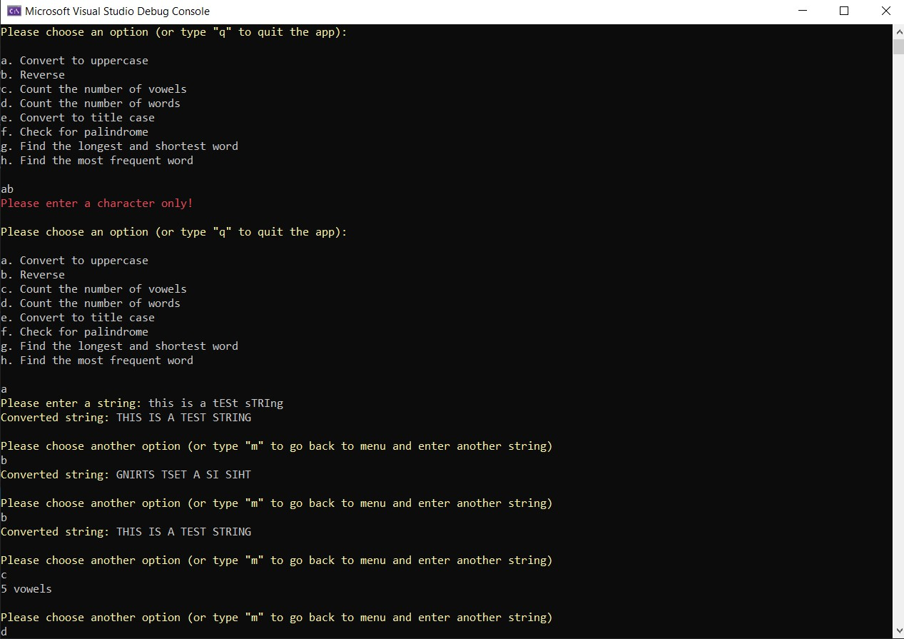
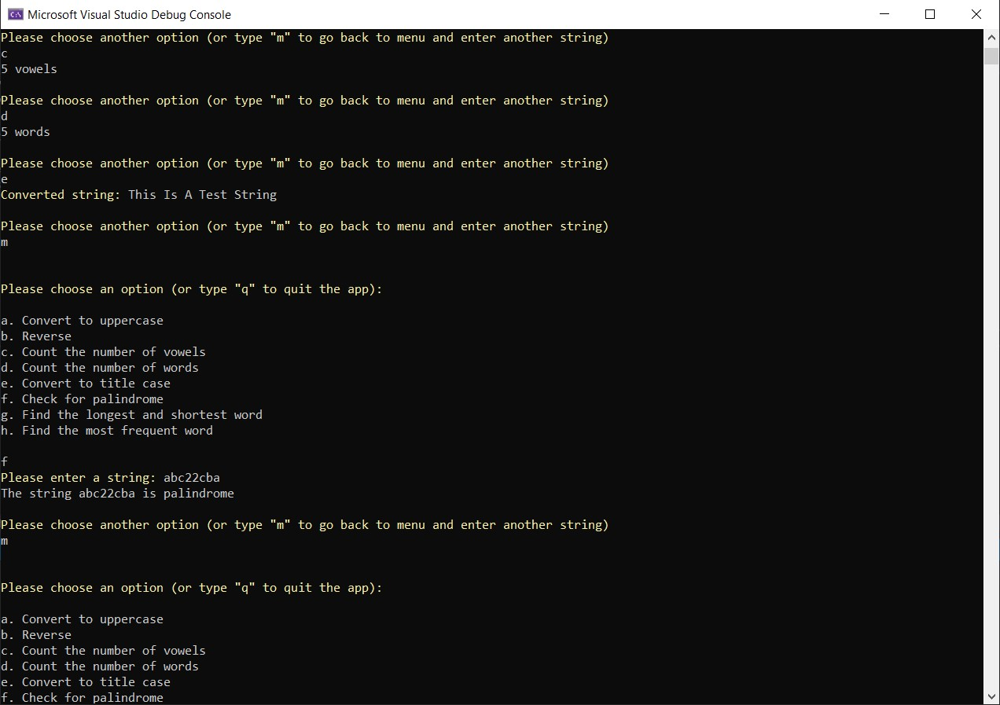
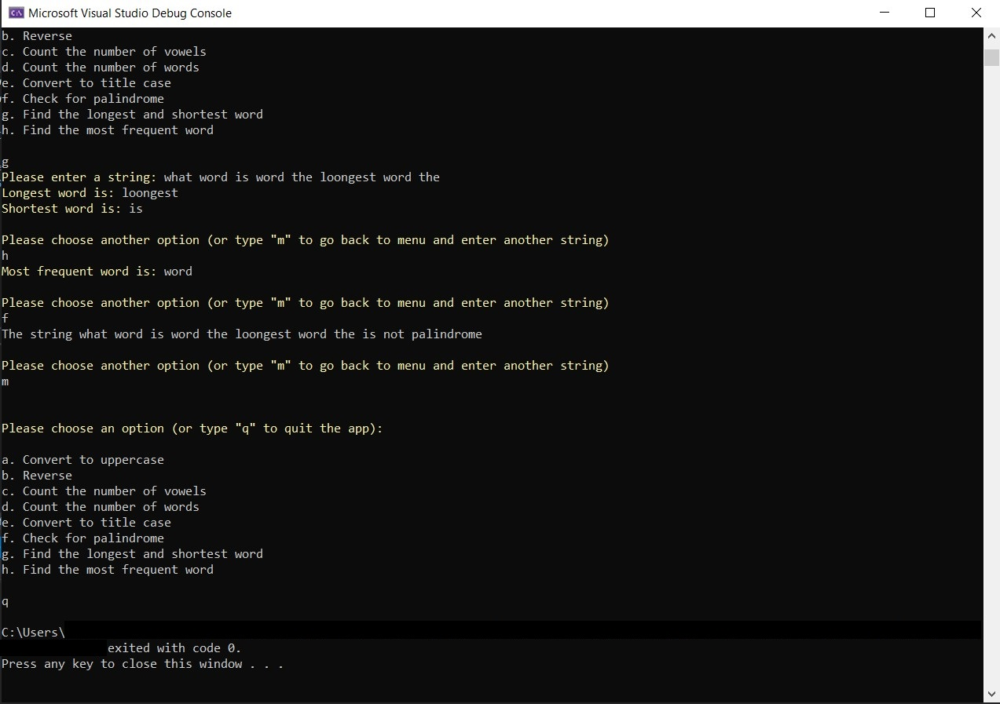

# String Manipulation

This is a simple console app that performs various string manipulation operations. 

### How to use

1. Clone this repo on your computer
2. Run the project in Microsoft Visual Studio
3. Go back to the project folder, search for "String_Manipulation.exe" and run it

### Screenshots

